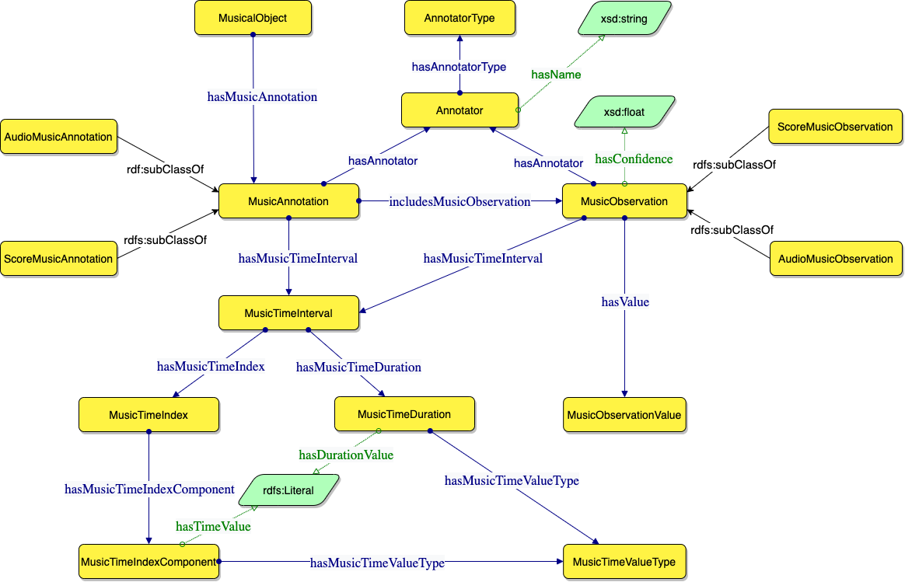
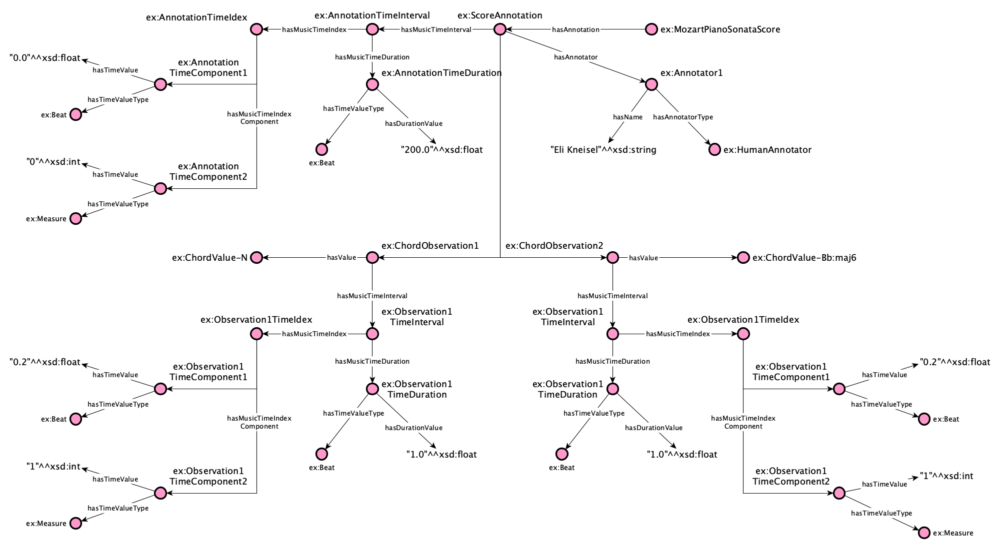
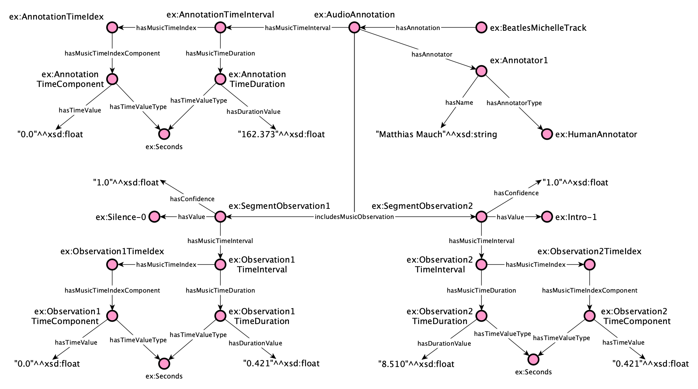

# Music Annotation Pattern
The Music Annotation Pattern is an [Ontology Design Pattern (ODP)](http://ontologydesignpatterns.org/wiki/) for 
modelling different types of musical annotations. For example, this ODP can be used to describe musical chords, 
notes rather than patterns, both harmonic and melodic and structural annotations. The Music Annotation ODP also aims to
represent annotations derived from different types of sources, such as audio and score.

## The Music Annotation Pattern

The structure of the Music Annotation ODP consists of the relations between an *Annotation* and its *Observations*. 
These terms are borrowed from the [JAMS library](https://jams.readthedocs.io/en/stable/), which can be considered a standard in the field.

The Competency Questions (CQs) used to model the pattern are as follows:

| ID       | Competency questions                                                                                                       |
|----------|----------------------------------------------------------------------------------------------------------------------------|
| **CQ1**  | What is the type of an annotation/observation for a musical object?                                                        |
| **CQ2**  | What is the time frame within the musical object addressed by an annotation?                                               |
| **CQ3**  | What is its start time (i.e. the starting time of the time frame)?                                                         |
| **CQ4**  | Which are the observations included in an annotation?                                                                      |
| **CQ5**  | For a specific observation, what is the starting point of its addressed time frame, within its reference musical object? ! |
| **CQ6**  | For a specific observation, what is its addressed time frame, within the musical object?                                   |
| **CQ7**  | What is the value of an observation?                                                                                       |
| **CQ8**  | Who/what is the annotator of an annotation/observation, and what is its type?                                              |
| **CQ9**  | What is the confidence of an observation?                                                                                  |
| **CQ10** | What is the musical object addressed by an annotation?                                                                     |

The Music Annotation Pattern is available at the following URI:

<pre style="text-align: center">
<a href="https://purl.org/andreapoltronieri/music-notation-pattern">https://purl.org/andreapoltronieri/music-notation-pattern</a>
</pre>

The pattern can be represented graphically as follows (We use the [Graffoo notation](https://essepuntato.it/graffoo/): 
yellow boxes are classes, blue/green arrows are object/datatype properties, purple circles are individuals, green 
polygons are datatypes):

### Testing

To test the pattern, for each of these CQs, a corresponding SPARQL Query was developed and is available in the 
[queries folder](./queries). 

## Usage Examples 

In this section, we describe two examples of usage of the Music Annotation ODP.
We remind that this ODP addresses different types of annotations for different types of sources (e.g. score, audio). 
The examples show how the Music Annotation ODP can be used to describe: (i) musical chord annotations and (ii) structural annotations of a song.

### Chord Annotations

The first example is an annotation of chords from a music score of Wolfgang Amadeus Mozart’s Piano Sonata no. 1 in C major (Allegro). The original annotation is taken from the [Mozart Piano Sonatas Dataset](https://transactions.ismir.net/articles/10.5334/tismir.63/#:~:text=The%20dataset%20consists%20of%20expert,cadence%20labels%20(5%20types).). 
The Figure below depicts the resulting RDF graph using the Grafoo Notation8. In all the examples, dummy prefix and namespace (ex: and http://example.org/) are defined for instances.

### Structural Annotations

The second example is an annotation of segments from an audio track of The Beatles’ Michelle. The original annotation is available in JAMS format and is taken from the [Isophonics Dataset](http://isophonics.net/datasets).

## License 
MIT License

Copyright (c) 2022 Andrea Poltronieri, Jacopo de Berardinis, Valentina Presutti and Albert Meroño-Peñuela

Permission is hereby granted, free of charge, to any person obtaining a copy
of this software and associated documentation files (the "Software"), to deal
in the Software without restriction, including without limitation the rights
to use, copy, modify, merge, publish, distribute, sublicense, and/or sell
copies of the Software, and to permit persons to whom the Software is
furnished to do so, subject to the following conditions:

The above copyright notice and this permission notice shall be included in all
copies or substantial portions of the Software.

THE SOFTWARE IS PROVIDED "AS IS", WITHOUT WARRANTY OF ANY KIND, EXPRESS OR
IMPLIED, INCLUDING BUT NOT LIMITED TO THE WARRANTIES OF MERCHANTABILITY,
FITNESS FOR A PARTICULAR PURPOSE AND NONINFRINGEMENT. IN NO EVENT SHALL THE
AUTHORS OR COPYRIGHT HOLDERS BE LIABLE FOR ANY CLAIM, DAMAGES OR OTHER
LIABILITY, WHETHER IN AN ACTION OF CONTRACT, TORT OR OTHERWISE, ARISING FROM,
OUT OF OR IN CONNECTION WITH THE SOFTWARE OR THE USE OR OTHER DEALINGS IN THE
SOFTWARE.
